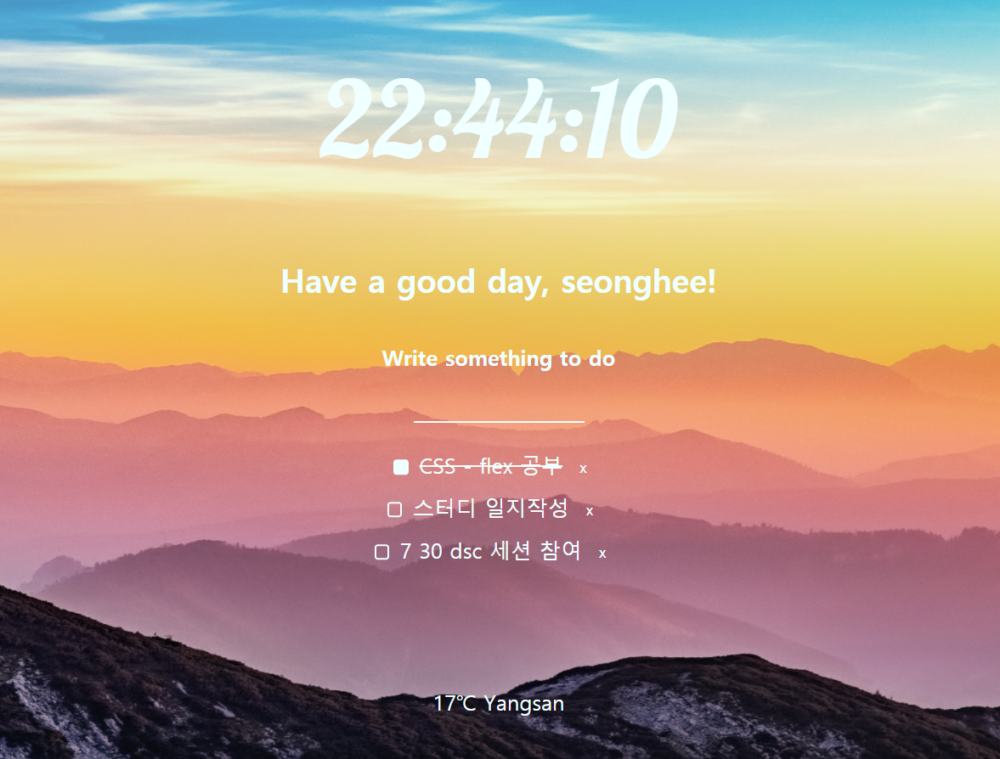
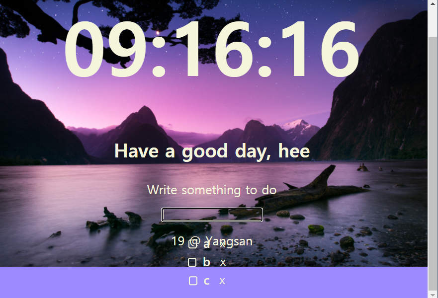
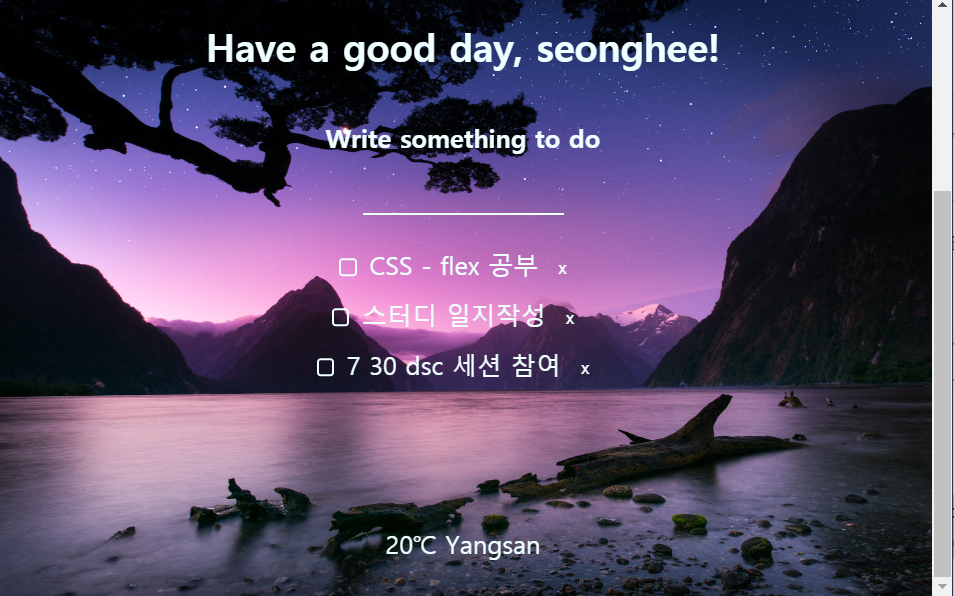

> ### 노마드 코더의 '바닐라 JS로 크롬 앱 만들기' 수업을 들으며 만들었던 Momentum을 
> ### 백지코딩하며 다시 만들어보고, 개선하였습니다.
> ### 수업을 들으며 알게된 내용은 ([Momentum의_README](https://github.com/SeongheeJeon/Momentum/blob/master/README.md))에 있습니다.    

</img>

## 수정 사항
- 배경 이미지 fixed 처리. (스크롤시에도 고정되도록)   

</img> -> </img>
- 할일 목록의 id 중복가능성 제거.  
  -> 기존 : '할일 목록 갯수 +1'로 id를 부여  
  -> 수정후 : 로컬 스토리지에 카운터 변수 cnt 추가. +1 해가며 순서대로 id 부여.
 

## 알게된 것
- CSS에서 속성의 순서에 주의해야한다.  
  -> 첫줄부터 마지막줄까지 순차적으로 속성이 적용되고 중복될경우 앞의 속성은 무시될 수 있기 때문.  
+ 추후 추가예정
